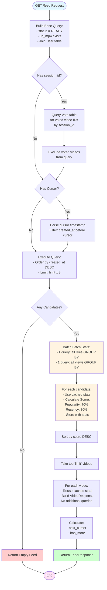

# Feed Endpoint Requirements & Analysis

## Overview

The `/feed` endpoint provides a simple video feed with a basic recommendation algorithm. It uses session-based filtering to exclude videos already voted on, implements cursor-based pagination, and uses a simple popularity + recency scoring system to rank videos.

**Endpoint:** `GET /api/v1/feed`  
**Location:** `backend/app/api/v1/feed.py`

---

## 1. Endpoint Specification

### 1.1 Request Parameters

| Parameter | Type | Required | Default | Constraints | Description |
|-----------|------|----------|---------|-------------|-------------|
| `session_id` | `string` | No | `None` | UUID format | Session ID to filter out videos already voted on (like or not_like) |
| `cursor` | `string` | No | `None` | ISO 8601 datetime format | Cursor for pagination (created_at timestamp) |
| `limit` | `integer` | No | `10` | `1 ≤ limit ≤ 50` | Maximum number of videos to return |

### 1.2 Authentication

- **Not Required**: The endpoint works without authentication
- **Session-based filtering**: If `session_id` is provided, videos that have been voted on (like or not_like) by that session are excluded
- **All users**: Get recommendations based on global popularity metrics and recency

### 1.3 Response Format

```json
{
  "videos": [
    {
      "id": "uuid",
      "title": "string",
      "description": "string",
      "status": "ready",
      "thumbnail": "url",
      "url_mp4": "url",
      "duration_seconds": 0,
      "error_reason": null,
      "ad_link": null,
      "user": {
        "id": "uuid",
        "username": "string"
      },
      "stats": {
        "likes": 0,
        "views": 0
      },
      "created_at": "ISO 8601 datetime"
    }
  ],
  "next_cursor": "ISO 8601 datetime or null",
  "has_more": boolean
}
```

---

## 2. Data Provisioning Flow

### 2.1 Phase 1: Base Query Construction

**Initial Filters:**
1. **Video Status**: Only `VideoStatus.READY` videos
2. **MP4 Availability**: Videos must have a non-null, non-empty `url_mp4`
3. **User Join**: Join with `User` table to get creator information

**SQL Equivalent:**
```sql
SELECT Video.*, User.*
FROM videos Video
JOIN users User ON Video.user_id = User.id
WHERE Video.status = 'ready'
  AND Video.url_mp4 IS NOT NULL
  AND Video.url_mp4 != ''
```

### 2.2 Phase 2: Session-Based Filtering

**Voted Videos Exclusion:**
- If `session_id` is provided, exclude videos that have been voted on (like or not_like) by that session
- Rationale: Users should not see videos they've already interacted with
- Both "like" and "not_like" votes exclude the video from the feed

**Implementation:**
- Query `Vote` table for all videos where `session_id = provided_session_id`
- Add `Video.id NOT IN (voted_video_ids)` to the query
- Error handling: If session_id is invalid or vote filtering fails, continue without exclusion (graceful degradation)

### 2.3 Phase 3: Cursor Pagination

**Cursor Mechanism:**
- If `cursor` parameter is provided, filter videos where `created_at < cursor_time`
- Cursor format: ISO 8601 datetime string (e.g., `2024-01-15T10:30:00Z`)
- Error handling: If cursor parsing fails, ignore it and continue

**Purpose:** Enables infinite scroll / pagination by fetching videos older than the cursor timestamp

### 2.4 Phase 4: Candidate Selection

**Query Execution:**
- Order by `created_at DESC` (newest first)
- Fetch `limit * 3` candidates (3x oversampling for scoring)
- Rationale: Score all candidates, then select top N after sorting

**Example:** If `limit=10`, fetch 30 candidates, score them all, return top 10

### 2.5 Phase 5: Batch Stats Fetching & Video Scoring

**Batch Stats Fetching:**
1. Extract all candidate video IDs
2. **Batch fetch all likes** in one query using `GROUP BY` with `IN` clause
   - Query: `SELECT video_id, COUNT(*) FROM votes WHERE video_id IN (...) AND direction = 'like' GROUP BY video_id`
   - Result: Dictionary mapping `video_id -> likes_count`
3. **Batch fetch all views** in one query using `GROUP BY` with `IN` clause
   - Query: `SELECT video_id, COUNT(*) FROM views WHERE video_id IN (...) GROUP BY video_id`
   - Result: Dictionary mapping `video_id -> views_count`

**Scoring Algorithm:**
For each candidate video, calculate a recommendation score using `calculate_video_score()` with pre-fetched stats. The scoring algorithm is the same for all users.

**Components:**
1. **Popularity Score (70% weight)**
   - Formula: `(likes / views) * min(views, 100) / 100`
   - Base: `0.3 + (popularity * 0.7)`
   - Rationale: Higher like-to-view ratio with view count cap at 100
   - Ensures videos with good engagement get prioritized

2. **Recency Score (30% weight)**
   - Formula: `max(0, 1.0 - (days_old / 30))`
   - Adds: `recency * 0.3` to score
   - Rationale: Videos less than 30 days old get a boost
   - Prevents feed from becoming stale with old content

**Final Score Range:** Approximately `0.3 - 1.3`

**Note:** 
- No creator-based scoring or personalization. All videos are scored using the same algorithm based on global popularity and recency.
- Stats (likes, views) are cached in the scored_videos tuple for reuse in response building.

### 2.6 Phase 6: Ranking & Selection

1. Sort all scored videos by score (descending)
2. Take top `limit` videos
3. Skip videos that cause errors during scoring (graceful degradation)

### 2.7 Phase 7: Response Building

For each selected video:
1. **Reuse cached stats** (likes, views) from scoring phase (no additional queries)
2. Build `VideoResponse` object with:
   - Video metadata (id, title, description, etc.)
   - Creator info (UserBasic)
   - Stats (likes, views) - from cached data
   - Timestamps

**Optimization:** Stats are already fetched during scoring phase, so no additional database queries are needed for response building.

**Error Handling:** Skip videos that cause errors during response building

### 2.8 Phase 8: Pagination Metadata

**Next Cursor Calculation:**
- If `len(candidates) > limit` AND videos exist:
  - `next_cursor = last_video.created_at.isoformat()`
- Otherwise: `next_cursor = None`

**Has More Flag:**
- `has_more = len(candidates) > limit`

---

## 3. Error Handling Strategy

The endpoint implements **defensive programming** with multiple layers of error handling:

1. **Top-level try-catch**: Catches any unhandled exceptions, returns empty feed
2. **Vote filtering errors**: Logs warning, continues without filtering
3. **Cursor parsing errors**: Logs warning, ignores cursor
4. **Scoring errors**: Logs warning, skips problematic video
5. **Response building errors**: Silently skips problematic video

**Philosophy:** Never fail completely - always return a response (even if empty)

---

## 4. Performance Considerations

### 4.1 Database Queries

**Per Request (Optimized):**
- 1 query for base candidate selection (with joins)
- 1 query for voted videos exclusion (if session_id provided)
- 1 batch query for all likes (all candidates at once using `GROUP BY` with `IN` clause)
- 1 batch query for all views (all candidates at once using `GROUP BY` with `IN` clause)
- 0 queries for response building (uses cached stats from scoring)

**Total Queries:** Approximately `1 + 1 + 1 + 1 = 4-5 queries` for a typical request (down from 82!)

**Optimization Implemented:**
- ✅ Batch queries for scoring (using `IN` clauses with `GROUP BY`)
- ✅ Cached stats reuse in response building (no duplicate queries)
- ✅ Reduced N+1 query problems with batch operations

**Future Optimization Opportunities:**
- Pre-calculate popularity metrics in background jobs
- Use database views or materialized views for stats
- Cache feed results for common queries
- Add database indexes on `video_id` for votes and views tables

### 4.2 Oversampling Strategy

- Fetch `limit * 3` candidates to ensure enough high-scoring videos after filtering
- Trade-off: More database queries vs. better recommendation quality

---

## 5. Algorithm Characteristics

### 5.1 Personalization Level

- **No Personalization**: All users get the same scoring algorithm
- **Session-based filtering**: Only difference is which videos are excluded based on session votes
- **Global metrics**: All scoring is based on global popularity and recency

### 5.2 Simplicity

- Single scoring algorithm for all videos
- No user-specific preferences or creator bias
- Easy to understand and maintain

### 5.3 Session-Based Filtering

- Videos voted on by a session (like or not_like) are excluded
- Ensures users don't see videos they've already interacted with
- Works without authentication

### 5.4 Recency Boost

- All videos get recency boost (decays over 30 days)
- Prevents feed from becoming stale
- Newer content gets higher scores

---

## 6. Flow Diagram



---

## 7. Key Design Decisions

### 7.1 Why Exclude All Voted Videos?

- Users should not see videos they've already interacted with (like or not_like)
- Keeps feed fresh and discovery-focused
- Simple rule: if voted, exclude it

### 7.2 Why Session-Based Instead of User-Based?

- Works without authentication
- Simpler implementation
- Each session gets its own feed state
- Can be merged to user account later if user signs up

### 7.3 Why 3x Oversampling?

- Ensures enough high-quality videos after scoring
- Accounts for videos that might be filtered out during scoring
- Provides buffer for error cases

### 7.4 Why Cursor-Based Pagination?

- More reliable than offset-based (avoids duplicates on concurrent updates)
- Natural fit with time-ordered feed
- Better performance for large datasets

### 7.5 Why Batch Queries?

- **Optimized implementation**: Uses batch queries with `GROUP BY` and `IN` clauses
- **Efficient**: Only 4-5 queries total instead of 80+ individual queries
- **Cached stats**: Stats fetched during scoring are reused in response building
- **Performance**: ~95% reduction in database queries compared to naive implementation
- **Maintainable**: Simple, clear code that's easy to understand and modify

---

## 8. Future Improvements

1. **Query Optimization** ✅ (Partially Implemented)
   - ✅ Batch queries using `IN` clauses for scoring
   - ✅ Cached stats reuse in response building
   - Use database aggregations for stats (could join stats in main query)
   - Implement caching layer for popular videos
   - Add database indexes on `video_id` for votes and views

2. **Scoring Enhancements**
   - Add diversity multiplier (prevent too many from same creator)
   - Add category/tag-based scoring
   - Machine learning integration for better recommendations
   - User preference learning (if authentication is added)

3. **Performance**
   - Pre-calculate popularity scores in background jobs
   - Use materialized views for stats
   - Implement Redis caching for feed results
   - Optimize database indexes

4. **Features**
   - Filter by category/tags
   - Geographic preferences
   - Time-of-day preferences
   - Watch history integration
   - Creator-based personalization (optional)

---

## 9. Testing Considerations

### 9.1 Test Cases

1. **No Session ID**
   - Returns videos sorted by popularity + recency
   - No voted videos exclusion
   - All eligible videos shown

2. **With Session ID (No Votes)**
   - Returns videos sorted by popularity + recency
   - No exclusion (session hasn't voted on anything)

3. **With Session ID (With Votes)**
   - Voted videos (like and not_like) excluded
   - Only unvoted videos shown
   - Scoring based on popularity + recency only

4. **Pagination**
   - Cursor works correctly
   - `has_more` flag accurate
   - No duplicate videos across pages
   - Cursor maintains exclusion of voted videos

5. **Edge Cases**
   - Empty database
   - All videos voted on by session
   - Invalid session_id format
   - Invalid cursor format
   - Database errors
   - Session with no votes

### 9.2 Performance Tests

- Measure query count
- Measure response time
- Test with large datasets (1000+ videos)
- Test with many candidates (high limit)

---

## 10. Summary

The `/feed` endpoint implements a **simple recommendation system** that combines:
- **Collaborative filtering** (popularity metrics based on likes/views)
- **Temporal signals** (recency boost for newer content)
- **Session-based filtering** (excludes videos already voted on)

It prioritizes **simplicity and reliability** over complexity, with extensive error handling and graceful degradation. The algorithm is designed to be:
- **Simple**: Easy to understand and maintain
- **Fast**: Minimal logic, straightforward queries
- **Reliable**: Always returns a response, even if empty
- **Extensible**: Can be enhanced with personalization later

The endpoint works without authentication, making it accessible to all users while maintaining session-based state through the `session_id` parameter.

